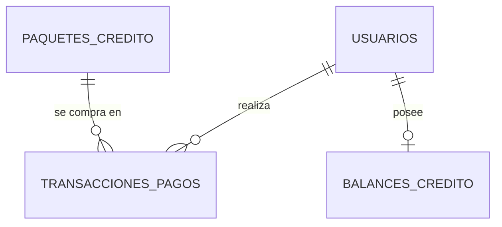

# Guía de Billing: créditos, paquetes y transacciones de pago

### Pinta Ebook — Documentación Técnica (módulo `billing` — Estado Actual)

> **Estado:**
> - Modelo de datos de paquetes y pagos (`CreditPackage`, `PaymentTransaction`): implementado y migrado.
> - `GET /api/billing/balance/` (saldo): existente.
> - `POST /api/billing/checkout/` (iniciar el pago de un paquete, tk084): implementado, probado con 23 tests automáticos y con el modo mock. **Todavía no probado contra Mercado Pago real** (faltan credenciales de prueba). Ver sección [7](#7-endpoints).
> - Las variables de entorno de Mercado Pago están documentadas en `.env.example` y en la sección [11](#11-configuración-variables-de-entorno).
> - **Todavía no existe el webhook de Mercado Pago**: pagar no acredita créditos ni cambia el estado de la transacción.

## Índice

1. [Qué incluye esta guía](#1-qué-incluye-esta-guía)
2. [Relaciones](#2-relaciones)
3. [Tablas](#3-tablas)
4. [Estados de una transacción](#4-estados-de-una-transacción)
5. [Reglas de integridad](#5-reglas-de-integridad)
6. [Cómo usarlo desde código (backend)](#6-cómo-usarlo-desde-código-backend)
7. [Endpoints](#7-endpoints)
8. [Cómo verificar](#8-cómo-verificar)
9. [Decisiones de diseño](#9-decisiones-de-diseño)
10. [Puntos abiertos](#10-puntos-abiertos)
11. [Configuración (variables de entorno)](#11-configuración-variables-de-entorno)

## 1. Qué incluye esta guía

Esta guía cubre dos entregas del módulo `billing`:

- **tk083:** modelos `CreditPackage` y `PaymentTransaction` (secciones 2 a 5).
- **tk084:** integración con Mercado Pago y endpoint de checkout (secciones 6, 7 y 11).

Se agregaron a `apps/billing/models.py` las dos entidades de pagos definidas en el Diagrama Relacional PostgreSQL (bloque *FINANZAS*):

| Entidad Django | Tabla PostgreSQL | Para qué sirve |
|---|---|---|
| `CreditPackage` | `paquetes_credito` | Catálogo de paquetes de créditos que un usuario puede comprar |
| `PaymentTransaction` | `transacciones_pagos` | Un registro por cada intento de pago de un usuario por un paquete |
| `EstadoTransaccion` | (no es tabla) | Lista de estados válidos de un pago |

Archivos involucrados:

| Archivo | Entrega | Qué hace |
|---|---|---|
| `apps/billing/models.py` | tk083 | Modelos `CreditPackage`, `PaymentTransaction` y `EstadoTransaccion` |
| `apps/billing/migrations/0002_creditpackage_paymenttransaction.py` | tk083 | Crea las tablas y constraints |
| `infrastructure/mercadopago_client.py` | tk084 | Adaptador de Mercado Pago: crea la preferencia de pago y traduce los errores. Es el **único** archivo que conoce Mercado Pago |
| `apps/billing/services.py` | tk084 | `BillingService.create_checkout` (lógica del checkout) y errores de negocio |
| `apps/billing/serializers.py` | tk084 | `CheckoutRequestSerializer`: valida el body |
| `apps/billing/views.py` | tk084 | `BillingCheckoutView`: recibe el request y responde `201` |
| `apps/billing/urls.py` | tk084 | Ruta `billing/checkout/` |
| `apps/billing/test_checkout.py` | tk084 | 23 tests del checkout y del cliente de Mercado Pago |
| `.env.example` | tk084 | Documenta las variables `MERCADOPAGO_*` (sin valores reales) |

El módulo `billing` ya contenía, antes de estas entregas, el modelo `CreditBalance` (saldo de créditos del usuario), `get_balance`, `deduct_credits` y el endpoint de saldo. **No se modificaron.**

### Qué NO incluye

- Un endpoint para **listar** paquetes: no existe, y por ahora la tabla `paquetes_credito` no se carga desde ninguna API.
- Procesamiento de webhooks de Mercado Pago.
- Lógica para acreditar créditos al saldo del usuario cuando un pago se aprueba.
- Cambios de estado de una transacción: el checkout solo la crea en `pendiente`.

Según el cronograma del proyecto, el webhook de Mercado Pago corresponde a una tarea posterior (US-08, US-09 y US-10).

El checkout (`POST /api/billing/checkout/`) sí está implementado: ver sección 7.

## 2. Relaciones



- Un usuario puede tener muchas transacciones (puede comprar múltiples paquetes).
- Cada transacción pertenece a un único paquete y a un único usuario.
- Un usuario tiene un único saldo (`balances_credito`).

## 3. Tablas

### 3.1 `paquetes_credito` (`CreditPackage`)

| Columna | Tipo PostgreSQL | Restricciones |
|---|---|---|
| `id` | `integer` (identity, 32 bits) | PK |
| `nombre` | `varchar(100)` | NOT NULL, UNIQUE |
| `cantidad_creditos` | `integer` | NOT NULL, CHECK `> 0` |
| `precio` | `numeric(10,2)` | NOT NULL, CHECK `>= 0` |

### 3.2 `transacciones_pagos` (`PaymentTransaction`)

| Columna | Tipo PostgreSQL | Restricciones |
|---|---|---|
| `id` | `integer` (identity, 32 bits) | PK |
| `usuario_id` | `uuid` | NOT NULL, FK a `usuarios.id` |
| `paquete_id` | `integer` | NOT NULL, FK a `paquetes_credito.id` |
| `id_transaccion_externa` | `varchar(255)` | NOT NULL, UNIQUE |
| `monto` | `numeric(10,2)` | NOT NULL, CHECK `> 0` |
| `estado_transaccion` | `varchar(50)` | NOT NULL, CHECK IN (ver sección 4) |
| `fecha` | `timestamptz` | NOT NULL, DEFAULT `statement_timestamp()` |

Notas sobre campos:

- **`id_transaccion_externa`**: identificador del pago en la pasarela (Mercado Pago). Es UNIQUE para que no se pueda registrar dos veces el mismo pago si el webhook llega repetido.
- **`monto`**: lo que realmente se cobró. Se guarda aparte del `precio` del paquete para que el historial no cambie si luego se modifica el precio.
- **`fecha`**: la completa PostgreSQL automáticamente; no hay que enviarla al crear una transacción.

### 3.3 `balances_credito` (`CreditBalance`) — ya existente

| Columna | Tipo | Detalle |
|---|---|---|
| `id` | `uuid` | PK |
| `usuario_id` | `uuid` | Relación uno a uno con el usuario |
| `credits_available` | entero, no negativo | Créditos disponibles. El campo vale `0` por defecto, pero al crearse un usuario una signal (`apps/billing/signals.py`) le crea el saldo con `INITIAL_WELCOME_CREDITS` (hoy `1000`) |
| `last_updated` | `timestamptz` | Se actualiza automáticamente en cada modificación |

Es el modelo que expone el endpoint de la sección 7.

## 4. Estados de una transacción

Valores válidos de `estado_transaccion` (clase `EstadoTransaccion`):

| Valor guardado | Significado previsto |
|---|---|
| `pendiente` | Pago iniciado, todavía sin resultado |
| `aprobado` | Pago confirmado |
| `fallido` | Pago que no se pudo completar |
| `reembolsado` | Pago devuelto al usuario |
| `cancelado` | Pago cancelado |

> El significado es provisorio. Las transiciones permitidas entre estados y el momento en que se acreditan créditos se definirán en la tarea de integración de pagos; **no están implementadas en esta entrega**.

## 5. Reglas de integridad

Las reglas están definidas **en la base de datos**, no solo en Python. Si se intenta guardar un dato inválido (desde el ORM, el shell o SQL directo), PostgreSQL lo rechaza y Django lanza `IntegrityError`.

| Regla | Constraint |
|---|---|
| Un paquete tiene cantidad de créditos mayor a 0 | `paquete_cantidad_creditos_positiva` |
| El precio de un paquete no es negativo | `paquete_precio_no_negativo` |
| El monto de una transacción es mayor a 0 | `transaccion_monto_positivo` |
| El estado es uno de los 5 valores válidos | `transaccion_estado_valido` |
| No hay dos paquetes con el mismo nombre | `UNIQUE (nombre)` |
| No se registra dos veces el mismo pago externo | `UNIQUE (id_transaccion_externa)` |

### Qué pasa al borrar

| Acción | Resultado |
|---|---|
| Borrar un **usuario** | Se borran también sus transacciones (`on_delete=CASCADE`) |
| Borrar un **paquete** con transacciones asociadas | No se permite (`on_delete=PROTECT`, Django lanza `ProtectedError`) |

Estas dos reglas las aplica el ORM de Django. En la base, las FK están declaradas como `DEFERRABLE INITIALLY DEFERRED` (se verifican al hacer commit) y sin cláusula `ON DELETE`.

## 6. Cómo usarlo desde código (backend)

```python
from apps.billing.models import CreditPackage, PaymentTransaction, EstadoTransaccion

paquete = CreditPackage.objects.get(nombre="...")

PaymentTransaction.objects.create(
    usuario=usuario,
    paquete=paquete,
    id_transaccion_externa="id-del-pago-en-la-pasarela",
    monto=paquete.precio,
    estado_transaccion=EstadoTransaccion.PENDIENTE,
)
```

- Usar siempre `EstadoTransaccion.<ESTADO>` en lugar de strings sueltos.
- No se envía `fecha`: la completa la base.
- Desde un usuario se accede a sus pagos con `usuario.payment_transactions`, y desde un paquete con `paquete.payment_transactions`.

### Iniciar un checkout desde el backend

No hace falta crear la transacción a mano: el servicio hace todo el flujo (leer el paquete, crear la preferencia en Mercado Pago y registrar la transacción `pendiente`).

```python
from apps.billing.services import BillingService

resultado = BillingService.create_checkout(user=request.user, paquete_id=4)
# {'init_point': 'https://...'}
```

Orden de lo que hace `create_checkout`:

1. Busca el paquete. Si no existe lanza `CreditPackageNotFoundError` (404). Si su precio es 0 lanza `CreditPackageNotPurchasableError` (400).
2. Llama a Mercado Pago (`create_preference`) con el nombre y el precio **del paquete en la base**. Si falla lanza `PaymentGatewayUnavailableError` (503) o `PaymentGatewayError` (502).
3. Recién entonces inserta la `PaymentTransaction` en `pendiente`, con el ID de la preferencia en `id_transaccion_externa`.

`create_checkout` acepta un parámetro opcional `gateway=` para inyectar otro cliente de pagos (útil en tests). Si no se pasa, usa `MercadoPagoClient()`.

## 7. Endpoints

### Estado actual

| Entidad | Endpoints |
|---|---|
| `CreditPackage` (paquetes) | **Ninguno para listarlos.** El checkout solo recibe un `paquete_id` |
| `PaymentTransaction` (pagos) | `POST /api/billing/checkout/` (crea la transacción pendiente, ver abajo). **Sin endpoint de consulta ni webhook todavía** |
| `CreditBalance` (saldo) | `GET /api/billing/balance/` (existente, ver abajo) |

Para el equipo de frontend: **no existe un endpoint que liste los paquetes**, así que hoy el `paquete_id` hay que conocerlo de antemano. No construir servicios de Angular para listar paquetes ni para consultar pagos hasta que se documenten acá.

### `GET /api/billing/balance/`

Devuelve el saldo de créditos del usuario autenticado. La implementación de Angular (servicio, manejo de errores) está en el **Paso A: Consultar Saldo** de `workflow_ebooks_guia_actual.md`; esta ficha resume el contrato verificado en el código.

| Campo | Detalle |
|---|---|
| Método y ruta | `GET /api/billing/balance/` (el prefijo `/api/` lo define `config/urls.py`) |
| Autenticación | Obligatoria. Enviar el token de acceso en el header `Authorization` (formato exacto en el Paso A de la guía de e-books) |
| Request | **Sin body y sin parámetros.** El usuario se identifica por el token; no se envía ningún id |
| Respuesta exitosa | `200 OK` con el JSON de abajo |
| Sin autenticación válida | La API rechaza la petición (código 401 o 403 de Django REST Framework, según la configuración de autenticación) |

**Respuesta `200 OK`:**

```json
{
  "credits_available": 0,
  "last_updated": "2026-10-07T16:50:00.123456Z"
}
```

| Campo | Tipo | Descripción |
|---|---|---|
| `credits_available` | número entero, mayor o igual a 0 | Créditos disponibles del usuario |
| `last_updated` | string, fecha y hora en formato ISO 8601 | Última vez que se modificó el saldo. La zona horaria depende de la configuración del proyecto |

**Comportamiento a tener en cuenta:**

- Si el usuario todavía no tiene saldo, el endpoint **lo crea en ese momento con 0 créditos**. Nunca responde 404 por "usuario sin saldo".
- Los nombres de los campos llegan tal cual, en `snake_case` (`credits_available`, no `creditsAvailable`).
- La respuesta tiene **solo** esos dos campos: no incluye `id` ni datos del usuario.
- `last_updated` llega como string; hay que convertirlo a `Date` si se quiere formatear.
- Es **solo lectura**: el saldo no se modifica desde este endpoint.

### `POST /api/billing/checkout/`

Inicia el pago de un paquete de créditos: crea la preferencia de pago en Mercado Pago, registra la transacción en `transacciones_pagos` con estado `pendiente` y devuelve la URL de pago a la que el frontend debe redirigir al usuario.

| Campo | Detalle |
|---|---|
| Método y ruta | `POST /api/billing/checkout/` |
| Autenticación | Obligatoria. Header `Authorization: Bearer <access_token>` (JWT) |
| Content-Type | `application/json` |
| Respuesta exitosa | `201 Created` |

**Request (body):**

```json
{ "paquete_id": 4 }
```

| Campo | Tipo | Obligatorio | Regla |
|---|---|---|---|
| `paquete_id` | entero | Sí | Mayor o igual a 1 y menor o igual a 2147483647. Es el `id` de un paquete existente |

- **No enviar** `monto`, `usuario_id` ni ningún otro dato. El monto se toma siempre del paquete en la base de datos y el usuario sale del token. Los campos de más se ignoran.

**Respuesta `201 Created`:**

```json
{
  "init_point": "https://example.com/mock-checkout?pref_id=MOCK-39f07e667ee6421cba582f0b81c50e51"
}
```

| Campo | Tipo | Descripción |
|---|---|---|
| `init_point` | string (URL) | Página de pago de Mercado Pago a la que hay que redirigir al usuario. En modo sandbox el backend ya devuelve la URL de sandbox: el frontend no tiene que distinguir |

**Errores:**

| Código | Cuándo | Cuerpo de ejemplo | Verificado |
|---|---|---|---|
| `400` | Falta `paquete_id` | `{"paquete_id": ["This field is required."]}` | Prueba manual |
| `400` | `paquete_id` no es un entero | `{"paquete_id": ["A valid integer is required."]}` | Prueba manual |
| `400` | `paquete_id` menor a 1 | `{"paquete_id": ["Ensure this value is greater than or equal to 1."]}` | Prueba manual |
| `400` | El paquete tiene precio 0 y no se puede comprar | `{"detail": "El paquete de créditos seleccionado no se puede comprar."}` | Tests automáticos |
| `401` | Falta el token | `{"detail": "Authentication credentials were not provided."}` | Prueba manual |
| `401` | Token inválido o vencido | El cuerpo puede variar | Comportamiento estándar del JWT, no probado manualmente |
| `404` | El paquete no existe | `{"detail": "El paquete de créditos solicitado no existe."}` | Prueba manual |
| `502` | Mercado Pago rechazó el pedido o respondió algo inválido | `{"detail": "La pasarela de pagos devolvió una respuesta inesperada. Intente nuevamente más tarde."}` | Tests automáticos |
| `503` | Mercado Pago no responde, tardó demasiado o está caído (también si el servidor no tiene configuradas las credenciales) | `{"detail": "La pasarela de pagos no está disponible en este momento. Intente nuevamente más tarde."}` | Tests automáticos |

**Qué tener en cuenta en el frontend:**

- **Decidir por el código HTTP, no por el texto.** Los mensajes de error mezclan español e inglés (los de validación vienen en inglés por defecto) y pueden cambiar. Los errores de validación (`400`) traen el nombre del campo como clave; los demás traen `detail`.
- **Redirigir con una navegación completa**, por ejemplo `window.location.href = respuesta.init_point`. No es una llamada HTTP más.
- **Deshabilitar el botón mientras el request está en curso.** Cada respuesta `201` crea una transacción `pendiente` nueva: un doble clic genera dos.
- **El backend espera hasta 10 segundos** a Mercado Pago antes de responder `503`.
- **Pagar todavía no acredita créditos.** Como el webhook no existe, después del pago el saldo (`GET /api/billing/balance/`) no cambia y la transacción sigue `pendiente`. No mostrar al usuario "créditos acreditados" a partir de este endpoint.
- **El usuario no vuelve solo a la aplicación.** Todavía no están configuradas las URLs de retorno (`back_urls`), así que al terminar de pagar se queda en Mercado Pago. Falta que el equipo de frontend defina esas URLs.
- **Entornos de desarrollo:** con el modo mock activo, `init_point` apunta a una página de ejemplo (`example.com`) y no a Mercado Pago.

**Ejemplo orientativo en Angular** (asume que el interceptor de autenticación ya agrega el header, como en el Paso A de la guía de e-books, y que la URL base de la API se define según el proyecto):

```ts
@Injectable({ providedIn: 'root' })
export class BillingService {
  private readonly baseUrl = '/api'; // reemplazar por la URL base real de la API

  constructor(private http: HttpClient) {}

  iniciarCheckout(paqueteId: number): Observable<{ init_point: string }> {
    return this.http.post<{ init_point: string }>(
      `${this.baseUrl}/billing/checkout/`,
      { paquete_id: paqueteId }
    );
  }
}
```

```ts
this.billingService.iniciarCheckout(paqueteId).subscribe({
  next: ({ init_point }) => { window.location.href = init_point; },
  error: (err) => {
    if (err.status === 502 || err.status === 503) {
      // La pasarela no está disponible: pedir al usuario que reintente más tarde
    }
    // 400, 401 y 404: ver la tabla de errores
  },
});
```

### Plantilla para documentar endpoints nuevos

Cuando se implementen endpoints de paquetes o pagos (listado de paquetes, creación de un pago, webhook de Mercado Pago, etc.), documentarlos con esta estructura:

| Campo | Qué documentar |
|---|---|
| Método y ruta | Por ejemplo `GET /api/...` |
| Autenticación | Si requiere token y de qué rol |
| Request | Headers, parámetros y body JSON con tipo y si es obligatorio cada campo |
| Response exitosa | Código HTTP y body JSON de ejemplo |
| Errores | Códigos posibles, body de error y su causa |

## 8. Cómo verificar

Con los contenedores levantados (los nombres salen de `docker ps`):

```bash
# Aplicar la migración
docker exec pintaebook_web python manage.py migrate billing

# Ver la estructura real (usuario y base están en el .env: POSTGRES_USER y POSTGRES_DB)
docker exec pintaebook_db psql -U <POSTGRES_USER> -d <POSTGRES_DB> -c "\d paquetes_credito"
docker exec pintaebook_db psql -U <POSTGRES_USER> -d <POSTGRES_DB> -c "\d transacciones_pagos"
```

Para probar que la base rechaza datos inválidos, abrir `python manage.py shell` y crear un `CreditPackage` con `cantidad_creditos=0` o `precio=-1`: debe lanzar `IntegrityError`.

Para probar el endpoint de saldo hace falta un usuario registrado y su token de acceso (ver los pasos de autenticación en la guía de e-books).

Para probar el checkout en local sin Mercado Pago, activar el modo mock (sección 11), cargar un paquete (`CreditPackage`) y llamar a `POST /api/billing/checkout/` con el token. La respuesta debe ser `201` y debe aparecer una fila `pendiente` en `transacciones_pagos` con el monto del paquete y un `id_transaccion_externa` que empieza con `MOCK-`. 

**Tests automáticos:**

```bash
docker exec pintaebook_web python manage.py test apps.billing
```

Resultado esperado hoy: **28 tests**. Los 23 de `test_checkout.py` (10 del endpoint y 13 del cliente de Mercado Pago) pasan. **Fallan 4 tests preexistentes** de `BillingTests` (`tests.py`): esperan 100 créditos de bienvenida y la signal da 1000. No se tocaron en tk084; ver sección 10.

Para correr solo los del checkout: `python manage.py test apps.billing.test_checkout`.

**Sobre el modo mock:** las variables se leen del `.env` con `django-environ`, no de `docker-compose.yml`. Si se cambia el `.env` hay que recrear el contenedor (ver sección 11).

## 9. Decisiones de diseño

- **`CheckConstraint` además de `choices`:** `choices` solo valida en Python (formularios, serializers); el constraint garantiza la regla en la base.
- **`id` declarado como `AutoField`:** respeta el `SERIAL` de 32 bits del diagrama sin depender de `DEFAULT_AUTO_FIELD`.
- **`IntegerField` en `cantidad_creditos`:** `PositiveIntegerField` agrega su propio `CHECK >= 0` y duplicaría la regla `> 0` del diagrama.
- **`db_default` en `fecha`:** el `DEFAULT` lo define PostgreSQL, como pide el diagrama, y aplica también a inserciones que no pasan por el ORM.

Decisiones del checkout (tk084):

- **Tres capas (vista → servicio → adaptador):** la vista solo valida y responde; el servicio decide; `infrastructure/mercadopago_client.py` es el único que conoce Mercado Pago. Cambiar de pasarela toca un solo archivo.
- **Se llama a Mercado Pago antes de insertar en la base, y fuera de una transacción de base de datos:** si la pasarela falla, no queda ninguna fila `pendiente` huérfana, y no se mantiene una transacción abierta durante una llamada de red de hasta 10 segundos. La contracara: si la pasarela responde bien y el insert falla, queda una preferencia sin fila (se registra en el log y se relanza el error).
- **El monto sale siempre del paquete en la base, nunca del request:** el cliente no puede elegir cuánto pagar.
- **`requests` en lugar del SDK de Mercado Pago:** se usa un solo endpoint, y así el timeout y el mapeo de errores quedan bajo nuestro control y fáciles de testear.
- **Errores tipados:** timeout, error de conexión, 5xx y 429 de Mercado Pago → `503` (reintentable). Otros 4xx, JSON inválido o respuesta sin `init_point` → `502` (la pasarela respondió, pero algo no sirve). Sin credenciales configuradas → `503`.
- **Un solo `init_point` en la respuesta:** según `MERCADOPAGO_SANDBOX`, el backend elige `sandbox_init_point` o `init_point`; el frontend no distingue.
- **Modo mock apagado por defecto:** evita que se active solo en producción.
- **Moneda fija `ARS`:** decisión del equipo por ahora.
- **`create_checkout` recibe `gateway=` opcional:** permite probar el servicio con un doble de prueba sin tocar la red.

## 10. Puntos abiertos

- El diagrama define `balances_credito.id` como `SERIAL`, pero el modelo `CreditBalance` existente usa UUID. No se modificó.
- Con `CASCADE` desde usuario, borrar un usuario elimina su historial de pagos. Falta confirmar si es lo deseado a nivel contable.
- Solo se guarda el `monto` cobrado, no la cantidad de créditos de la compra. Si cambia `cantidad_creditos` de un paquete, no queda registro de cuántos créditos recibió una compra anterior.
- `precio >= 0` permite paquetes gratuitos, pero `monto > 0` no permite registrar el pago de uno.
- `fecha` es `timestamptz` (el diagrama indica `TIMESTAMP`) y su default es `statement_timestamp()`, equivalente en la práctica a `NOW()`.

Puntos abiertos del checkout:

- **No probado contra Mercado Pago real.** Solo se probó con el modo mock y con tests automáticos; faltan credenciales de prueba.
- **No hay endpoint para listar paquetes** ni una carga inicial de datos: la tabla `paquetes_credito` empieza vacía.
- **`external_reference`** guarda `<uuid_usuario>:<paquete_id>`, que no distingue dos compras iguales del mismo usuario. El webhook debería identificar la transacción por el ID de preferencia.
- **`id_transaccion_externa`** guarda hoy el ID de la **preferencia**, no el del pago final. El ticket del webhook tiene que decidir si lo actualiza o busca por preferencia.
- **Doble clic:** cada llamada crea una preferencia y una transacción `pendiente` nuevas. No hay deduplicación.
- **Paquetes gratuitos:** el checkout responde `400` porque `monto` debe ser mayor a 0.
- **URLs de retorno (`back_urls`)** sin definir: el usuario no vuelve solo a la aplicación.
- **Tests existentes desactualizados:** 4 tests de `BillingTests` en `tests.py` esperan 100 créditos de bienvenida y la signal da 1000 (`INITIAL_WELCOME_CREDITS`, commit `fab5d9c`). No se modificaron en este ticket.

## 11. Configuración (variables de entorno)

El cliente de Mercado Pago (`infrastructure/mercadopago_client.py`) lee estas variables. Se cargan desde el `.env` de la raíz del proyecto (`config/settings/base.py` lo lee con `django-environ`). El `.env` no se sube al repositorio y **nunca debe contener valores reales en `.env.example`**.

| Variable | Para qué sirve | Por defecto |
|---|---|---|
| `MERCADOPAGO_ACCESS_TOKEN` | Credencial de la API de Mercado Pago. Sin ella, el checkout real responde `503` | vacío |
| `MERCADOPAGO_SANDBOX` | `True`: devuelve el `sandbox_init_point` de Mercado Pago en lugar del `init_point` | `False` |
| `MERCADOPAGO_MOCK_MODE` | `True`: no llama a Mercado Pago ni necesita credenciales; devuelve una preferencia simulada (`MOCK-...`). Solo para desarrollo y pruebas | `False` |
| `MERCADOPAGO_BASE_URL` | URL base de la API | `https://api.mercadopago.com` |
| `MERCADOPAGO_BACK_URL_SUCCESS` | URL del frontend a la que vuelve el usuario tras un pago aprobado. Si no se define, no se envían `back_urls` | vacío |
| `MERCADOPAGO_BACK_URL_FAILURE` | Ídem para un pago fallido (si falta, usa la de éxito) | vacío |
| `MERCADOPAGO_BACK_URL_PENDING` | Ídem para un pago pendiente (si falta, usa la de éxito) | vacío |

Notas:

- El modo mock está **apagado por defecto** para que nunca se active solo en producción.
- La moneda de los pagos es siempre pesos argentinos (`ARS`).
- Cambiar el `.env` no afecta a un contenedor que ya está corriendo: hay que recrearlo (`docker compose up -d --force-recreate web`).