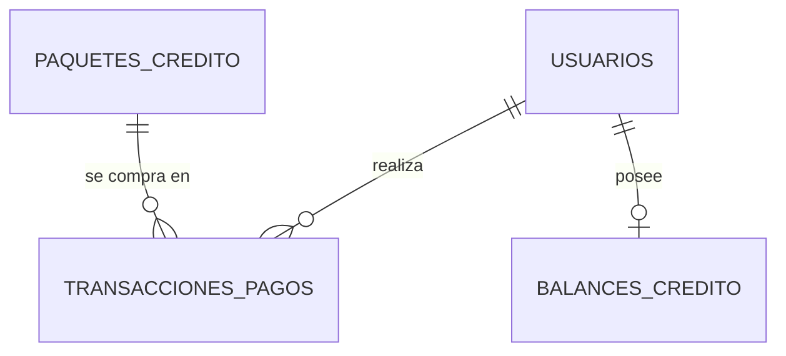

# Guía de Billing: créditos, paquetes y transacciones de pago

### Pinta Ebook — Documentación Técnica (módulo `billing` — Estado Actual)

> **Estado:**
> - Modelo de datos de paquetes y pagos (`CreditPackage`, `PaymentTransaction`): implementado y migrado, **sin endpoints todavía**.
> - Endpoint de saldo `GET /api/billing/balance/`: ya existente y documentado en la sección [7](#7-endpoints).

## Índice

1. [Qué incluye esta guía](#1-qué-incluye-esta-guía)
2. [Relaciones](#2-relaciones)
3. [Tablas](#3-tablas)
4. [Estados de una transacción](#4-estados-de-una-transacción)
5. [Reglas de integridad](#5-reglas-de-integridad)
6. [Cómo usarlo desde código (backend)](#6-cómo-usarlo-desde-código-backend)
7. [Endpoints](#7-endpoints)
8. [Cómo verificar](#8-cómo-verificar)
9. [Decisiones de diseño](#9-decisiones-de-diseño)
10. [Puntos abiertos](#10-puntos-abiertos)

## 1. Qué incluye esta guía

Se agregaron a `apps/billing/models.py` las dos entidades de pagos definidas en el Diagrama Relacional PostgreSQL (bloque *FINANZAS*):

| Entidad Django | Tabla PostgreSQL | Para qué sirve |
|---|---|---|
| `CreditPackage` | `paquetes_credito` | Catálogo de paquetes de créditos que un usuario puede comprar |
| `PaymentTransaction` | `transacciones_pagos` | Un registro por cada intento de pago de un usuario por un paquete |
| `EstadoTransaccion` | (no es tabla) | Lista de estados válidos de un pago |

Archivos involucrados:

- `apps/billing/models.py`
- `apps/billing/migrations/0002_creditpackage_paymenttransaction.py`

El módulo `billing` ya contenía, antes de esta entrega, el modelo `CreditBalance` (saldo de créditos del usuario) y el endpoint que lo expone. **No se modificaron.**

### Qué NO incluye

- Vistas, serializers ni rutas para paquetes y transacciones (no hay endpoints para esas entidades).
- Integración con Mercado Pago ni procesamiento de webhooks.
- Lógica para acreditar créditos al saldo del usuario cuando un pago se aprueba.

Según el cronograma del proyecto, la integración de pagos corresponde a una tarea posterior (webhooks de Mercado Pago, US-08, US-09 y US-10).

## 2. Relaciones



- Un usuario puede tener muchas transacciones (puede comprar múltiples paquetes).
- Cada transacción pertenece a un único paquete y a un único usuario.
- Un usuario tiene un único saldo (`balances_credito`).

## 3. Tablas

### 3.1 `paquetes_credito` (`CreditPackage`)

| Columna | Tipo PostgreSQL | Restricciones |
|---|---|---|
| `id` | `integer` (identity, 32 bits) | PK |
| `nombre` | `varchar(100)` | NOT NULL, UNIQUE |
| `cantidad_creditos` | `integer` | NOT NULL, CHECK `> 0` |
| `precio` | `numeric(10,2)` | NOT NULL, CHECK `>= 0` |

### 3.2 `transacciones_pagos` (`PaymentTransaction`)

| Columna | Tipo PostgreSQL | Restricciones |
|---|---|---|
| `id` | `integer` (identity, 32 bits) | PK |
| `usuario_id` | `uuid` | NOT NULL, FK a `usuarios.id` |
| `paquete_id` | `integer` | NOT NULL, FK a `paquetes_credito.id` |
| `id_transaccion_externa` | `varchar(255)` | NOT NULL, UNIQUE |
| `monto` | `numeric(10,2)` | NOT NULL, CHECK `> 0` |
| `estado_transaccion` | `varchar(50)` | NOT NULL, CHECK IN (ver sección 4) |
| `fecha` | `timestamptz` | NOT NULL, DEFAULT `statement_timestamp()` |

Notas sobre campos:

- **`id_transaccion_externa`**: identificador del pago en la pasarela (Mercado Pago). Es UNIQUE para que no se pueda registrar dos veces el mismo pago si el webhook llega repetido.
- **`monto`**: lo que realmente se cobró. Se guarda aparte del `precio` del paquete para que el historial no cambie si luego se modifica el precio.
- **`fecha`**: la completa PostgreSQL automáticamente; no hay que enviarla al crear una transacción.

### 3.3 `balances_credito` (`CreditBalance`) — ya existente

| Columna | Tipo | Detalle |
|---|---|---|
| `id` | `uuid` | PK |
| `usuario_id` | `uuid` | Relación uno a uno con el usuario |
| `credits_available` | entero, no negativo | Créditos disponibles. Por defecto `0` |
| `last_updated` | `timestamptz` | Se actualiza automáticamente en cada modificación |

Es el modelo que expone el endpoint de la sección 7.

## 4. Estados de una transacción

Valores válidos de `estado_transaccion` (clase `EstadoTransaccion`):

| Valor guardado | Significado previsto |
|---|---|
| `pendiente` | Pago iniciado, todavía sin resultado |
| `aprobado` | Pago confirmado |
| `fallido` | Pago que no se pudo completar |
| `reembolsado` | Pago devuelto al usuario |
| `cancelado` | Pago cancelado |

> El significado es provisorio. Las transiciones permitidas entre estados y el momento en que se acreditan créditos se definirán en la tarea de integración de pagos; **no están implementadas en esta entrega**.

## 5. Reglas de integridad

Las reglas están definidas **en la base de datos**, no solo en Python. Si se intenta guardar un dato inválido (desde el ORM, el shell o SQL directo), PostgreSQL lo rechaza y Django lanza `IntegrityError`.

| Regla | Constraint |
|---|---|
| Un paquete tiene cantidad de créditos mayor a 0 | `paquete_cantidad_creditos_positiva` |
| El precio de un paquete no es negativo | `paquete_precio_no_negativo` |
| El monto de una transacción es mayor a 0 | `transaccion_monto_positivo` |
| El estado es uno de los 5 valores válidos | `transaccion_estado_valido` |
| No hay dos paquetes con el mismo nombre | `UNIQUE (nombre)` |
| No se registra dos veces el mismo pago externo | `UNIQUE (id_transaccion_externa)` |

### Qué pasa al borrar

| Acción | Resultado |
|---|---|
| Borrar un **usuario** | Se borran también sus transacciones (`on_delete=CASCADE`) |
| Borrar un **paquete** con transacciones asociadas | No se permite (`on_delete=PROTECT`, Django lanza `ProtectedError`) |

Estas dos reglas las aplica el ORM de Django. En la base, las FK están declaradas como `DEFERRABLE INITIALLY DEFERRED` (se verifican al hacer commit) y sin cláusula `ON DELETE`.

## 6. Cómo usarlo desde código (backend)

```python
from apps.billing.models import CreditPackage, PaymentTransaction, EstadoTransaccion

paquete = CreditPackage.objects.get(nombre="...")

PaymentTransaction.objects.create(
    usuario=usuario,
    paquete=paquete,
    id_transaccion_externa="id-del-pago-en-la-pasarela",
    monto=paquete.precio,
    estado_transaccion=EstadoTransaccion.PENDIENTE,
)
```

- Usar siempre `EstadoTransaccion.<ESTADO>` en lugar de strings sueltos.
- No se envía `fecha`: la completa la base.
- Desde un usuario se accede a sus pagos con `usuario.payment_transactions`, y desde un paquete con `paquete.payment_transactions`.

## 7. Endpoints

### Estado actual

| Entidad | Endpoints |
|---|---|
| `CreditPackage` (paquetes) | **Ninguno todavía.** No hay nada para consumir |
| `PaymentTransaction` (pagos) | **Ninguno todavía.** No hay nada para consumir |
| `CreditBalance` (saldo) | `GET /api/billing/balance/` (existente, ver abajo) |

Para el equipo de frontend: **no existe contrato de request/response para paquetes ni pagos**. No construir servicios de Angular para ellos hasta que se documenten acá.

### `GET /api/billing/balance/`

Devuelve el saldo de créditos del usuario autenticado. La implementación de Angular (servicio, manejo de errores) está en el **Paso A: Consultar Saldo** de `workflow_ebooks_guia_actual.md`; esta ficha resume el contrato verificado en el código.

| Campo | Detalle |
|---|---|
| Método y ruta | `GET /api/billing/balance/` (el prefijo `/api/` lo define `config/urls.py`) |
| Autenticación | Obligatoria. Enviar el token de acceso en el header `Authorization` (formato exacto en el Paso A de la guía de e-books) |
| Request | **Sin body y sin parámetros.** El usuario se identifica por el token; no se envía ningún id |
| Respuesta exitosa | `200 OK` con el JSON de abajo |
| Sin autenticación válida | La API rechaza la petición (código 401 o 403 de Django REST Framework, según la configuración de autenticación) |

**Respuesta `200 OK`:**

```json
{
  "credits_available": 0,
  "last_updated": "2026-10-07T16:50:00.123456Z"
}
```

| Campo | Tipo | Descripción |
|---|---|---|
| `credits_available` | número entero, mayor o igual a 0 | Créditos disponibles del usuario |
| `last_updated` | string, fecha y hora en formato ISO 8601 | Última vez que se modificó el saldo. La zona horaria depende de la configuración del proyecto |

**Comportamiento a tener en cuenta:**

- Si el usuario todavía no tiene saldo, el endpoint **lo crea en ese momento con 0 créditos**. Nunca responde 404 por "usuario sin saldo".
- Los nombres de los campos llegan tal cual, en `snake_case` (`credits_available`, no `creditsAvailable`).
- La respuesta tiene **solo** esos dos campos: no incluye `id` ni datos del usuario.
- `last_updated` llega como string; hay que convertirlo a `Date` si se quiere formatear.
- Es **solo lectura**: el saldo no se modifica desde este endpoint.

### Plantilla para documentar endpoints nuevos

Cuando se implementen endpoints de paquetes o pagos (listado de paquetes, creación de un pago, webhook de Mercado Pago, etc.), documentarlos con esta estructura:

| Campo | Qué documentar |
|---|---|
| Método y ruta | Por ejemplo `GET /api/...` |
| Autenticación | Si requiere token y de qué rol |
| Request | Headers, parámetros y body JSON con tipo y si es obligatorio cada campo |
| Response exitosa | Código HTTP y body JSON de ejemplo |
| Errores | Códigos posibles, body de error y su causa |

## 8. Cómo verificar

Con los contenedores levantados (los nombres salen de `docker ps`):

```bash
# Aplicar la migración
docker exec pintaebook_web python manage.py migrate billing

# Ver la estructura real (usuario y base están en el .env: POSTGRES_USER y POSTGRES_DB)
docker exec pintaebook_db psql -U <POSTGRES_USER> -d <POSTGRES_DB> -c "\d paquetes_credito"
docker exec pintaebook_db psql -U <POSTGRES_USER> -d <POSTGRES_DB> -c "\d transacciones_pagos"
```

Para probar que la base rechaza datos inválidos, abrir `python manage.py shell` y crear un `CreditPackage` con `cantidad_creditos=0` o `precio=-1`: debe lanzar `IntegrityError`.

Para probar el endpoint de saldo hace falta un usuario registrado y su token de acceso (ver los pasos de autenticación en la guía de e-books).

## 9. Decisiones de diseño

- **`CheckConstraint` además de `choices`:** `choices` solo valida en Python (formularios, serializers); el constraint garantiza la regla en la base.
- **`id` declarado como `AutoField`:** respeta el `SERIAL` de 32 bits del diagrama sin depender de `DEFAULT_AUTO_FIELD`.
- **`IntegerField` en `cantidad_creditos`:** `PositiveIntegerField` agrega su propio `CHECK >= 0` y duplicaría la regla `> 0` del diagrama.
- **`db_default` en `fecha`:** el `DEFAULT` lo define PostgreSQL, como pide el diagrama, y aplica también a inserciones que no pasan por el ORM.

## 10. Puntos abiertos

- El diagrama define `balances_credito.id` como `SERIAL`, pero el modelo `CreditBalance` existente usa UUID. No se modificó.
- Con `CASCADE` desde usuario, borrar un usuario elimina su historial de pagos. Falta confirmar si es lo deseado a nivel contable.
- Solo se guarda el `monto` cobrado, no la cantidad de créditos de la compra. Si cambia `cantidad_creditos` de un paquete, no queda registro de cuántos créditos recibió una compra anterior.
- `precio >= 0` permite paquetes gratuitos, pero `monto > 0` no permite registrar el pago de uno.
- `fecha` es `timestamptz` (el diagrama indica `TIMESTAMP`) y su default es `statement_timestamp()`, equivalente en la práctica a `NOW()`.