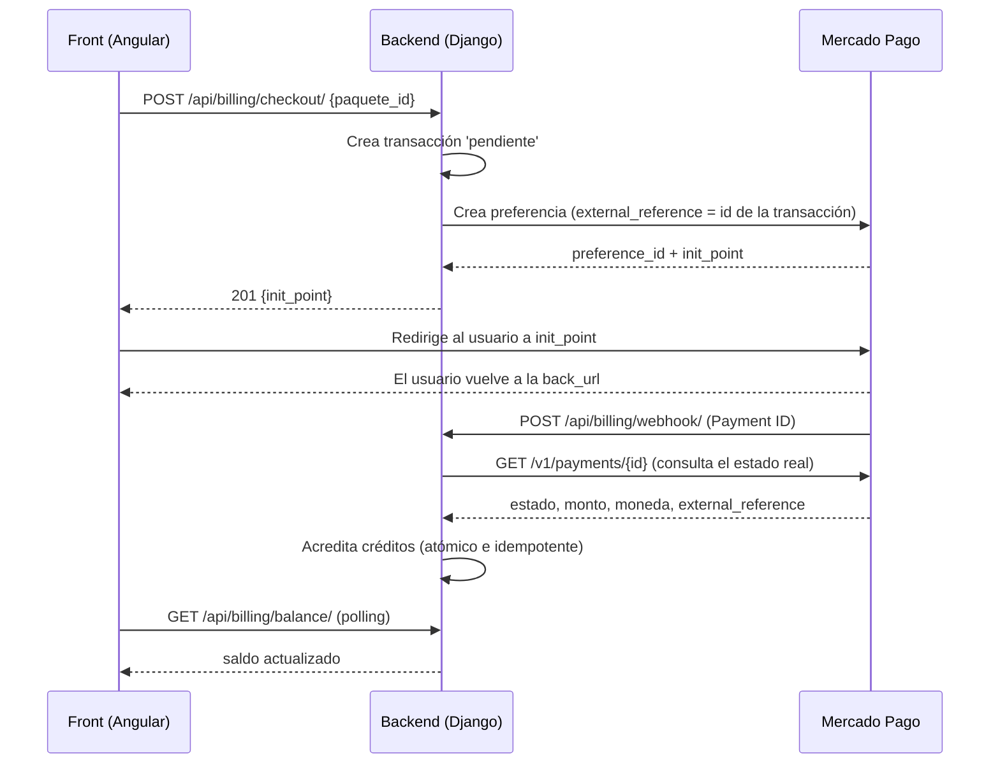

# Billing: checkout y webhook de Mercado Pago

Guía de cómo funciona la compra de créditos con Mercado Pago (MP), pensada para el equipo de backend y para quienes construyen los servicios de Angular.

> **Resumen en una línea:** el front inicia el pago con el checkout, MP cobra al usuario y **avisa al backend por un webhook**; el backend verifica el pago directamente con MP y recién ahí acredita los créditos. El front nunca acredita nada: solo redirige y luego consulta el saldo.

---

## 1. Para el front: lo esencial

### Lo que SÍ hay que hacer

1. Llamar a `POST /api/billing/checkout/` con el `paquete_id` (usuario autenticado con JWT).
2. Redirigir al usuario a la URL `init_point` que devuelve la respuesta.
3. Tener rutas de retorno (`success`, `failure`, `pending`) para cuando el usuario vuelve desde MP.
4. En la pantalla de retorno, **consultar el saldo** con `GET /api/billing/balance/` hasta que cambie (ver sección 4.3).

### Lo que NO hay que hacer

- **No llamar al webhook.** Lo llama MP, no la aplicación.
- **No confiar en los parámetros de la URL de retorno** (`status=approved`, `payment_id`, etc.). Cualquier usuario puede escribirlos a mano. La única fuente de verdad es el saldo que devuelve el backend.
- **No sumar créditos en el cliente** al volver del pago.
- **No permitir doble click en "Comprar".** Cada llamada al checkout crea una transacción nueva; deshabilitá el botón mientras la petición está en curso.

### Importante: la acreditación es asíncrona

Cuando el usuario vuelve a tu pantalla de éxito, **puede que el webhook todavía no haya llegado**. Por eso la pantalla de retorno no debe afirmar "créditos acreditados" por sí sola: debe mostrar "procesando" y confirmar con el saldo.

---

## 2. Flujo completo



Los dos últimos pasos pueden ocurrir en cualquier orden respecto al retorno del usuario: por eso el front consulta el saldo repetidamente.

---

## 3. Endpoints

### 3.1 `POST /api/billing/checkout/`

Inicia el pago de un paquete de créditos.

- **Autenticación:** JWT (`Authorization: Bearer <access_token>`).
- **Body:**

```json
{ "paquete_id": 2 }
```

- **Respuesta exitosa:** `201 Created`

```json
{ "init_point": "https://www.mercadopago.com.ar/checkout/v1/redirect?pref_id=..." }
```

El front redirige al usuario a esa URL (`window.location.href = init_point`). En entorno sandbox, la URL apunta al sandbox de MP.

- **Errores:**

| Código | Cuándo | Qué hacer en el front |
|---|---|---|
| 400 | Body inválido (`paquete_id` ausente, no numérico o ≤ 0) o paquete no comprable (precio 0). | Mostrar el error. Los errores de campo llegan como `{"paquete_id": ["..."]}`. |
| 401 | Sin JWT o token vencido. | Refrescar token / ir a login. |
| 404 | El paquete no existe. | Recargar el listado de paquetes. |
| 502 | MP respondió con un error o datos inválidos. | "No pudimos iniciar el pago, intentá de nuevo". |
| 503 | MP no está disponible o tardó demasiado. | Igual que el 502; se puede reintentar. |

Los errores con mensaje llegan como `{"detail": "..."}`.

**Importante:** el monto lo toma siempre el backend del paquete en la base de datos. El front **no envía ni puede modificar el precio**.

### 3.2 `POST /api/billing/webhook/` (solo para Mercado Pago)

El front **no usa este endpoint**. Está documentado para que el equipo entienda el sistema.

- **Autenticación:** ninguna (es público, lo llama MP). Su seguridad no depende de quién llama, sino de que el backend **verifica el pago con MP** (sección 5).
- **Qué recibe:** MP envía el tipo de evento y el ID del pago, en cualquiera de estos formatos (el backend los soporta todos):
  - Body JSON: `{"type": "payment", "data": {"id": "123456"}}`
  - Query: `?type=payment&data.id=123456`
  - Formato viejo: `?topic=payment&id=123456`

- **Respuestas:**

| Código | Cuándo | ¿MP reintenta? |
|---|---|---|
| 200 `{"detail": "OK"}` | Pago procesado, ya procesado antes, o ignorado por su estado (ver 5.3). | No |
| 200 `{"detail": "Notificación ignorada."}` | La notificación no es de tipo `payment` (por ejemplo `merchant_order`). | No |
| 400 | El Payment ID no es numérico. | Sí (la notificación es inválida) |
| 404 | MP no conoce ese pago. | Sí (a veces el pago tarda en estar consultable) |
| 502 / 503 | MP respondió mal o está caído al consultar el pago. | Sí (es lo que queremos) |

### 3.3 `GET /api/billing/balance/`

Devuelve el saldo disponible de créditos y la fecha de última actualización del usuario autenticado. Es el endpoint que el front usa para confirmar que el pago se acreditó (ver los campos exactos en `CreditBalanceSerializer`).

---

## 4. Cómo implementarlo en el front

### 4.1 Iniciar el pago

1. El usuario elige un paquete y toca "Comprar".
2. Deshabilitar el botón y llamar al checkout.
3. Si responde 201, redirigir a `init_point`. Si falla, mostrar el error y rehabilitar el botón.

### 4.2 URLs de retorno

MP devuelve al usuario a las URLs configuradas en el backend (`MERCADOPAGO_BACK_URL_SUCCESS`, `..._FAILURE`, `..._PENDING`). El front debe tener una ruta para cada una (o una sola para las tres). Coordinar las URLs finales con backend.

- `success`: pago aprobado en MP. Mostrar "procesando" y confirmar con el saldo.
- `pending`: el pago quedó pendiente (por ejemplo, pago en efectivo). Informar que se acreditará cuando se confirme.
- `failure`: el pago fue rechazado. Ofrecer volver a intentar (un nuevo intento crea una transacción nueva).

### 4.3 Confirmar la acreditación

Sugerencia de polling en la pantalla `success`:

1. Guardar el saldo antes de iniciar la compra (o leerlo al cargar la pantalla de retorno).
2. Consultar `GET /api/billing/balance/` cada 2 a 3 segundos, hasta un máximo de 30 segundos.
3. Si el saldo aumentó: mostrar "Créditos acreditados".
4. Si se agota el tiempo: mostrar "Tu pago se está procesando, el saldo se actualizará en unos minutos". No es un error: el webhook puede tardar y MP lo reintenta.

> Todavía no existe un endpoint que devuelva el estado de una transacción puntual. Si el front lo necesita (por ejemplo, para distinguir "pendiente" de "rechazado" sin depender del saldo), hay que pedirlo como ticket nuevo.

---

## 5. Cómo funciona el webhook por dentro (backend)

### 5.1 Los pasos

1. **Se recibe la notificación** y se extrae solo el Payment ID. El resto del contenido no se usa.
2. **Se consulta a MP** (`GET /v1/payments/{id}`) para obtener el estado real, el monto, la moneda y el `external_reference`.
3. **Se busca la transacción** con el `external_reference`, que es el ID de nuestra `PaymentTransaction` (lo fija el checkout al crear la preferencia).
4. **Dentro de una transacción de base de datos** se bloquea esa fila (`select_for_update`) y se decide:
   - Si ya está `aprobado`: no se hace nada (idempotencia).
   - Si MP dice `approved` y monto y moneda coinciden: se marca `aprobado` y se suman los créditos del paquete.
   - Si MP dice `rejected` o `cancelled` y la fila estaba `pendiente`: se marca `fallido` o `cancelado`.
   - Cualquier otro estado (`pending`, `in_process`, etc.): no se cambia nada.

La consulta a MP se hace **fuera** de la transacción de base de datos, para no mantener filas bloqueadas mientras se espera una respuesta de red.

### 5.2 Estados de una transacción

| Estado | Significado |
|---|---|
| `pendiente` | Se inició el checkout; esperando el resultado del pago. |
| `aprobado` | Pago confirmado y créditos acreditados. Estado final. |
| `fallido` | Pago rechazado, o MP falló al crear la preferencia. |
| `cancelado` | El pago fue cancelado. |
| `reembolsado` | Reservado; hoy los reembolsos no se procesan. |

Un pago rechazado **no** bloquea un intento posterior: el usuario puede reintentar con otra tarjeta sobre la misma preferencia, y si ese segundo pago se aprueba, se acredita.

### 5.3 Casos especiales

| Situación | Resultado |
|---|---|
| Mismo aviso llega dos veces (incluso a la vez) | Se acredita **una sola vez**. |
| Monto o moneda de MP distintos de los guardados | **No se acredita**; se registra un error en los logs. Se responde 200, así que requiere revisión manual. |
| `external_reference` que no es un número, o transacción inexistente | Se ignora (200) y se registra un warning. |
| MP caído al consultar el pago | 502/503, para que MP reintente. |

### 5.4 Idempotencia y concurrencia

MP puede enviar la misma notificación varias veces, a veces casi simultáneas. Si dos llegaran juntas sin protección, ambas verían la transacción como `pendiente` y acreditarían dos veces. El bloqueo de fila (`select_for_update`) dentro de una transacción atómica lo evita: la segunda notificación espera, y al entrar ya encuentra la transacción `aprobado`.

---

## 6. Seguridad

- **El endpoint es público**, así que nunca se confía en lo que llega. Del aviso solo se usa el Payment ID (validado como numérico), y el estado real se obtiene consultando a MP con nuestro token.
- **El monto lo decide el backend**, tomado del paquete al iniciar el checkout, y se compara con lo que MP dice que cobró.
- Pendiente (mejora futura): validar la cabecera `x-signature` de MP (firma HMAC) para descartar llamadas que no vienen de MP antes de consultar su API.

---

## 7. Configuración

Variables de entorno (en `.env`; ver `.env.example`). **Nunca subir tokens al repositorio.**

| Variable | Para qué sirve |
|---|---|
| `MERCADOPAGO_ACCESS_TOKEN` | Credencial para llamar a la API de MP. |
| `MERCADOPAGO_BASE_URL` | URL base de la API (por defecto `https://api.mercadopago.com`). |
| `MERCADOPAGO_SANDBOX` | Si es `True`, el checkout devuelve el `sandbox_init_point`. |
| `MERCADOPAGO_MOCK_MODE` | Si es `True`, el **checkout** usa una preferencia simulada (sin red). No afecta la consulta de pagos del webhook. |
| `MERCADOPAGO_BACK_URL_SUCCESS` / `_FAILURE` / `_PENDING` | A dónde vuelve el usuario tras pagar. |

**Pendiente de configurar:** la `notification_url` (la URL pública de `/api/billing/webhook/`) en el panel de MP o dentro de la preferencia. Sin esto MP no sabe a dónde avisar.

---

## 8. Cómo probar

### Tests automatizados

```
docker compose exec web python manage.py test apps.billing
```

Cubren el checkout, el cliente de MP y el webhook (acreditación, idempotencia, monto distinto, rechazados, notificaciones ignoradas, ID inválido). Los tests reemplazan a MP por un doble, así que no necesitan red ni credenciales.

### Prueba manual

El checkout se puede probar localmente con `MERCADOPAGO_MOCK_MODE=True`. El webhook, en cambio, consulta pagos reales a MP: para probarlo de punta a punta hace falta un token de prueba, un pago en el sandbox de MP y un túnel público (por ejemplo ngrok) para que MP pueda llegar a `localhost`.

---

## 9. Límites actuales y próximos pasos

- Configurar la `notification_url` en MP.
- Validar la firma `x-signature`.
- Procesar reembolsos (hoy se ignoran).
- Guardar el Payment ID en una columna propia para trazabilidad (hoy `id_transaccion_externa` conserva el ID de preferencia).
- Endpoint para consultar el estado de una transacción desde el front.
- Proceso de conciliación que revise transacciones pendientes por si algún aviso se pierde.
- Cuando MP falla al crear la preferencia, la transacción queda `fallido` (queda historial). Si el equipo prefiere no conservarla, se puede borrar.